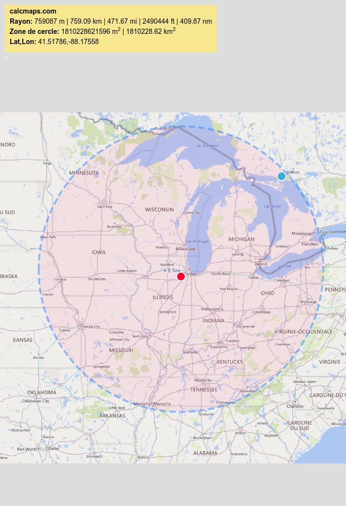
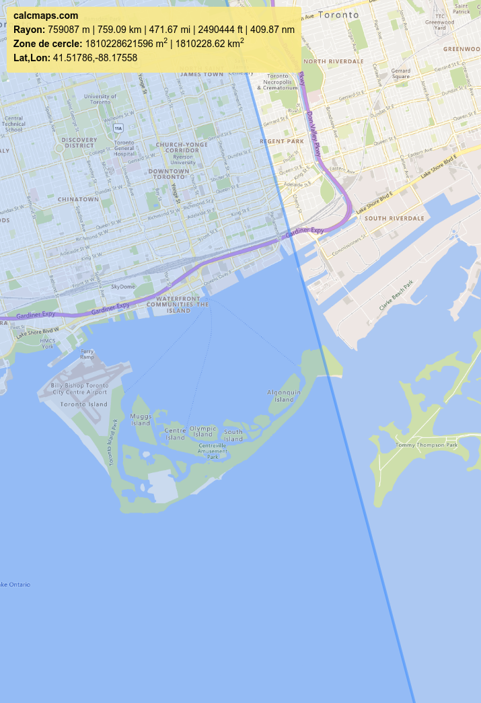

# Sur les traces de Scofield 3

## Write-up FR

Plusieurs éléments permettent de trouver le nom de la ville dans laquelle se trouve la plage:
- Le nom de la ville de Toronto sur un panneau de la photo
- Un champ "Description" dans les métadonnées de l'image (que l'on peut observer avec l'outil [exiftool](https://exiftool.org/)) indique "Toronto Islands"

Ensuite pour trouver la plage exacte, il faut utiliser l'information de la distance parcourue: 759 km. Pour ça on peut utiliser un outil comme [CalcMaps](https://www.calcmaps.com/fr/). Avec la fonctionnalité "Rayon" on trace un cercle partant de l'aérodrome de Joliet et mesurant 759 km de rayon.

Puis on va s'intéresser à l'intersection du cercle avec Toronto.

On peut notament remarquer que le cercle coupe "Ward's Island Beach" et lorsque l'on observe cette plage avec [Google Street View](https://maps.app.goo.gl/xjmiSmfhx3A7t8RB7) on reconnait l'endroit de la photo !

## Write-up EN

Several elements allow you to find the name of the city in which the beach is located:
- The name of the city of Toronto on a sign in the photo
- A "Description" field in the image metadata (which can be observed with the [exiftool](https://exiftool.org/) tool) indicates "Toronto Islands"

Then to find the exact range, you must use the information on the distance traveled: 759 km. For this we can use a tool like [CalcMaps](https://www.calcmaps.com/fr/). With the "Radius" functionality we draw a circle starting from the Joliet aerodrome and measuring 759 km in radius.

Then we will look at the intersection of the circle with Toronto.

We can notably notice that the circle intersects "Ward's Island Beach" and when we observe this beach with [Google Street View](https://maps.app.goo.gl/xjmiSmfhx3A7t8RB7) we recognize the location of the photo !

## Flag

`polycyber{ward's_island_beach}`
