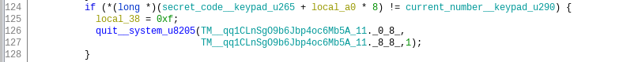
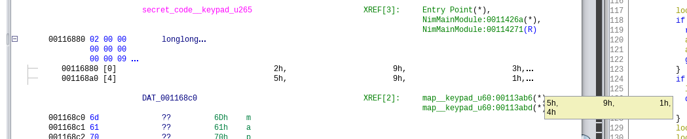

# keypad

## Write-up FR
Ouvrez le binaire dans un décompilateur et naviguez à la fonction `NimMainModule`. Vous y verrez toute la logique du programme. En particulier, une ligne fait la comparaison entre le chiffre courant et le chiffre correspondant dans le code secret.

Vous n'avez qu'à aller à ce symbole pour voir le bon PIN. Les chiffres sont encodés sur 64 bits, donc vous pouvez les afficher comme étant des `longlong` pour plus de clarté.

Vous pouvez maintenant lire les 8 chiffre et les utiliser pour créer le flag.

## Write-up EN
Open the binary in a decompiler and navigate to the `NimMainModule` fonction. You should see all the logic of the program there. In particular, there is one line that compares the current digit with the secret digit.

You only need to go to that symbol's address to find the correct keypad. The numbers are stored as 64 bits integers, so you need to cast the variable as an array of `longlong` for clarity.

You can then read the 8 digits and use them to craft the flag.

## Flag

`polycyber{29385914}`
